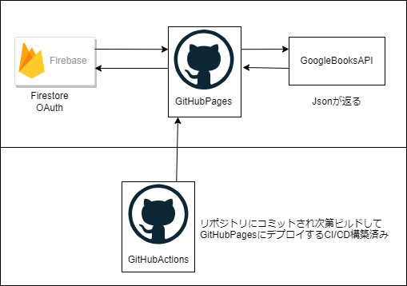
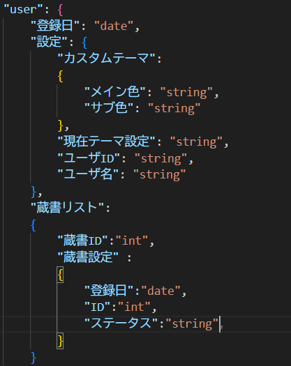
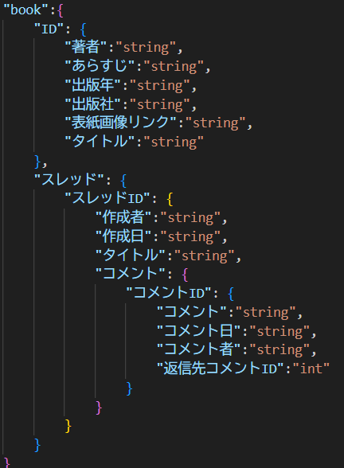

<!-- class: title-slide -->
# ReadNext
## 蔵書管理用Webサービスの紹介

### https://ootomonaiso-readnext.github.io/ReadNext/
---

<!-- class: content-slide -->
# ReadNextの機能

- 蔵書の登録
- 感想の投稿
- 書籍検索

---
<!-- class: content-slide -->
# 利用技術
- データベース: Firebase Firestore Database
- デプロイ先: GitHubActionsでビルドGitHubPagesにデプロイ
- 書籍情報取得: GoogleBooksAPI
- GitHub・Git
- VSCode

いずれも無料で利用できる範囲で構築

---
<!-- class: content-slide -->
# システム構成

---
<!-- class: content-slide -->
# Reactの利点
- バックエンドから独立してサーバーレスで動作する
- 仮想DOMで必要な部分だけ更新するシングルページアプリケーション
- JavaScript・TypeScriptで書ける

---
<!-- class: content-slide -->
# このサイトの寿命
- GitHub保存容量が約5GBを超え
- Firebaseの読み取り回数5万越え
- Firebaseの書き込み・削除回数2万超え
- 2040年11月26日になった瞬間

---
<!-- class: content-slide -->
# ログイン方法
## Firebaseに搭載されているログイン関連実装を利用
- Node.jsにあるFirebaseの拡張機能の関数で実装
- Googleアカウントの場合はGoogleOAuth
- 他のメールアドレスは認証メールによる確認を経てアカウント作成

---
<!-- class: content-slide -->
# OAuthとは
- 認可リクエストを送る
- GoogleやGitHubなどのOAuthプロバイダーにアクセス
- 認証されたら認可コードを返す
- 認可コードからアクセストークンを取りに行く
## データ漏洩リスクは低い

---
<!-- class: content-slide -->
# 書籍の検索
- GoogleBooksAPIは認証不要で戻り値がJsonのため採用
- 一度APIを利用し取得したデータはデータベースに登録
- サムネイル画像はGoogleBooksのリンクを設定

## APIアクセス制限のためにアクセス回数を減らす
## 画像保存を無くしてサーバー容量の削減

---
<!-- class: content-slide -->
# 蔵書関連
- usersテーブルに蔵書を登録するコレクションが存在
- booksテーブルの本IDを蔵書のキーとして保存
- 蔵書の呼び出し時、usersの蔵書を取得後booksに問い合わせ
- 蔵書追加日と状態を保存

---
<!-- class: content-slide -->
# CI/CDの実装
- GitHub Actionsの実行内容と実行フラグを管理するコンフィグ

---
<!-- class: content-slide -->
# CI/CDコード解説
- build-and-deployはビルドとデプロイを行う命令
- 実行環境はubuntuの最終環境を利用

---

---
<!-- class: content-slide -->
# 認証システム - 実行の流れ
- AuthContextをもとに認証状態の問い合わせ
- OAuthプロバイダへの問い合わせ用コード

---
<!-- class: content-slide -->
# 認証システム - 保護ルート

<section class="left-image-right-text">
  
  

    <ul>
      <li>認証状態が必要かどうかを宣言</li>
      <li>ProtectedRouteタグで認証必要部分を囲う</li>
    </ul>
  

</section>

---
<!-- class: content-slide -->
# 認証システム - リダイレクト

<section class="left-image-right-text">
  
  

    <ul>
      <li>サイトにアクセスしたら実行される</li>
      <li>認証情報を読み取り、 どこへリダイレクトするか判定</li>
      <li>アクセス時にAuthContextからFirebaseOAuthへリクエスト</li>
    </ul>
  

</section>

---
<!-- class: content-slide -->
# DB構成
<section class="left-image-right-text">
  
  

    <ul>
      <li>ユーザー関連データのみ保存</li>
      <li>ユーザー認証関連テーブルは別</li>
      <li>蔵書は本テーブルのIDが外部キー</li>
    </ul>
  

</section>

---
<!-- class: content-slide -->
# DB構成
<section class="left-image-right-text">
  
  

    <ul>
      <li>本データとスレッドデータを保存</li>
      <li>コレクションを分けて実行時余計なデータの読み取り防ぐ</li>
      <li>データが存在しない場合nullを割り当て</li>
    </ul>
  

</section>

